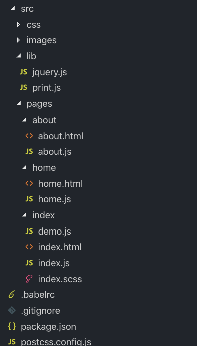

# 原生web页面脚手架
支持模块化、ES6+、Scss/Less、code spliting、代码混淆压缩等等   

### 为什么会考虑原生开发？

现在市场上流行的前端框架（React、Vue、Angular等）已经帮我们解决了大部分的需求，那么为什么我还要在这个时候考虑原生页面开发呢？

虽然我热衷于使用框架开发项目需求，但是我还是觉得有一部分需求不太适合使用框架去开发，比如：   
 * H5宣传页
 * 移动端和小程序内嵌H5页面（需求相对简单，较关注页面加载速度）
 * 门户网站（门户网站是一家企业的门面，因此门户网站的页面的体积要足够小，且门户网站交互逻辑很少，所以基本无需使用框架开发）

以上场景是我觉得原生开发会更好。

### 基于原生开发，还能做哪些事情，来提高开发效率、体验和可维护性？ 

众所周知，原生开发时我们将面临如下开发痛点：
 1. 关注html中的js文件顺序 
 2. js 全局变量污染
 3. 无法使用新的ES语法（新语法在大多数浏览器不兼容）
 4. 无法使用 css 预编译语言（sass, less等）   

因此，为了解决以上痛点，提高开发效率、体验和可维护性，对脚手架的规划是这样的：
 1. 支持模块化开发
 2. 支持 ES6+ 语法
 3. 支持 css 预编译，如 sass、less
 4. 支持多页面打包编译
 5. 支持 CSS3 前缀自动补全
 6. 支持 code spliting
 7. 支持代码压缩和混淆   

以上这几点都是为了提高开发效率和开发体验，以及提高代码可维护性   

所以，目前该项目刚好实现了以上功能！   

### 如何使用

如下图，可以看到脚手架的项目目录 src，这是脚手架的结构示例。

脚手架的使用约定：
 1. html页面必须放在src/pages目录中
 2. 每个html页面的入口js文件，必须与该html文件名相同
 
如：src/pages
        -- home/home.html
        -- home/home.js
        
这是整个脚手架的唯一一处约束，其他资源文件可在 src 目录下任意排布。

   


### 常用命令

启动开发环境
```
npm run dev
```
项目打包
```
npm run build
```
